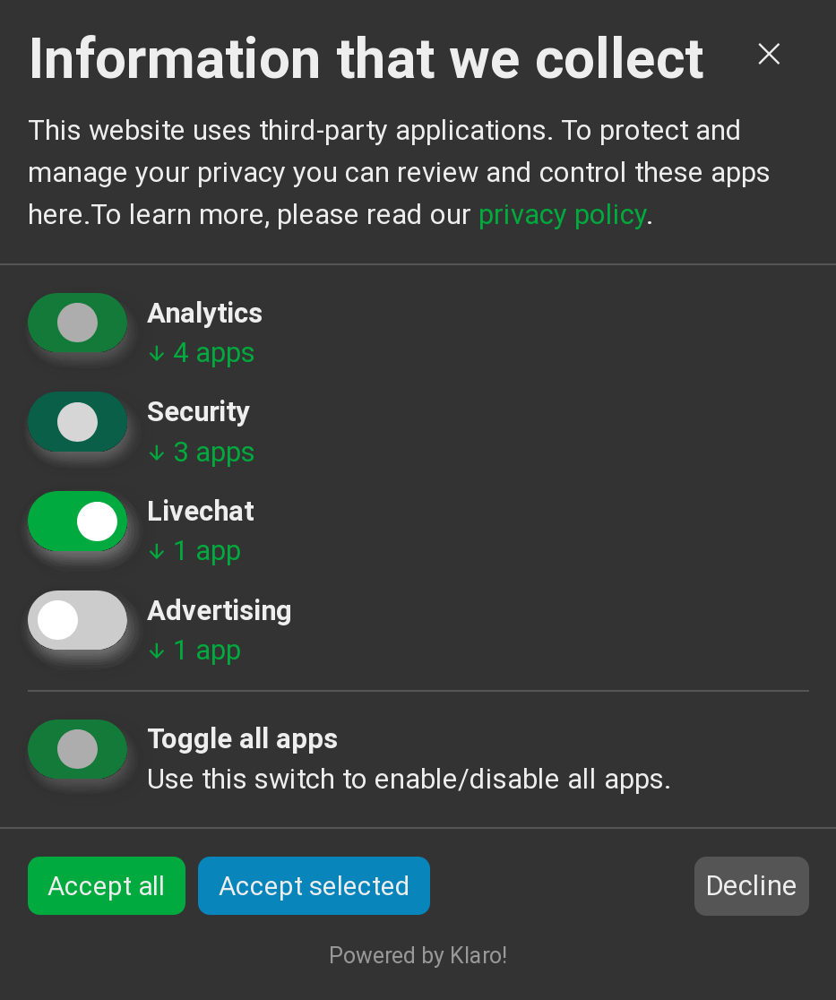
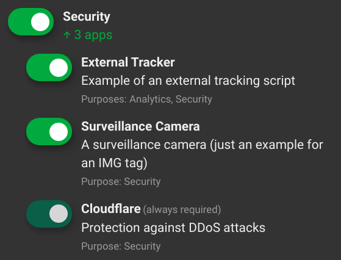

# Klaro! A Simple Consent Manager

Klaro [klɛro] is a simple consent management platform (CMP) and privacy tool that helps you to be transparent about the third-party applications on your website. It is designed to be extremely simple, intuitive and easy to use while allowing you to be compliant with all relevant regulations (notably GDPR and ePrivacy).

<p align="center">
    
    
</p>

Klaro supports multiple modes of asking for consent and can display third-party apps individually or grouped
by purpose.

## Advantages

* **Free and Open Source**: No hidden fees, subscriptions or restrictions.
* **Easy to use**: Simply add a small JS snippet and config to your site and
  you're ready to go!
* **Flexible and customizable**: Manage consent for all possible types of
  third-party apps and easily customize the tool according to your needs.
* **Multilingual**: Full internationalization support, with languages included out of the box. New translations can be added in just a few lines of code. Contributions welcome!\
Current languages: Catalan, Croatian, Dutch, English, Finnish, French, Galician, German, Greek, Hungarian, Italian, Norwegian, Romanian, Serbian (Latin and Cyrillic), Spanish, Swedish, Turkish
* **Small footprint**: The minified+gzipped JS is only 57 kB and contains
  everything that is required, including style sheets and translations.
* **Intuitive and responsive**: Klaro is designed to blend in with
  your existing design and optimized for modern desktop and mobile browsers.
* **Secure and reliable**: Klaro ensures that no third-party apps or
  trackers are executed without the consent of the user, even when
  JavaScript is disabled or Klaro itself gets blocked.

## Getting started

**You can now find more extensive documentation on [our website](https://heyklaro.com/docs/).**

To use the widget on your website, simply embed Klaro as well as a valid config. You can have a look at the [annotated config.js](dist/config.js) to see how it works. If you want to self-host Klaro you can download compiled JS files from the `dist` folder of this repository, or go to [our website](https://kiprotect.com/docs/klaro/releases), where you can find a full list of past Klaro releases. **Do not use the `klaro.js` file from the `src` folder, it will not work in the browser as it's an  ES6 module and needs to be transpiled first (for most browsers at least).** Follow the instructions below to adapt the config to your needs and then include the two files in your website like this:
```html
<!-- make sure the config gets loaded before Klaro -->
<script defer type="text/javascript" src="config.js"></script>
<script defer type="text/javascript" src="https://cdn.kiprotect.com/klaro/[klaro-version]/klaro.js"></script>

```

You should replace `[klaro-version]` with a version number (e.g. `v0.5.30`) to download a specific version of Klaro. **Important:** We no longer update  `latest` version tag in the CDN as loading Klaro from it might lead to breaking your installation when new major or minor versions are published. We will soon replace the tag with minor version tags (e.g. `0.7`) that will receive automated security upgrades and bugfixes and can be safely used to embed Klaro without risking breaking changes.

Do not forget to change your existing apps/trackers as outlined in the next section as well, so that Klaro can manage them. By default, Klaro will automatically open once the page is fully loaded.

We also provide a version of Klaro without stylesheets included, which is useful
in case you want to provide your own styles: [klaro-no-css.js](https://cdn.kiprotect.com/klaro/[klaro-version]/klaro-no-css.js). If you use this, make sure to either include your own styles or to include [klaro.min.css](https://cdn.kiprotect.com/klaro/[klaro-version]/klaro.min.css) separetely, like this:

```html
<link rel="stylesheet" href="https://cdn.kiprotect.com/klaro/[klaro-version]/klaro.min.css" />
```

We also provide a non-minified version of the stylesheet, which is great if you
want to make your own version: [klaro.css](https://cdn.kiprotect.com/klaro/[klaro-version]/klaro.css).

If you wish to open the consent manager manually on user interaction (for example through a link in the privacy policy), you can simply call ```klaro.show()``` via Javascript. Example:
```html
<a class="button is-success" onclick="return klaro.show();">Change consent settings</a>
```

Calling ```klaro.show(undefined, true)``` will force the modal to open, even if the user hasn't made a consent choice yet (by default, the consent notice would open first).

## Managing third-party apps/trackers

To manage third-party scripts and ensure they only run if the user consents with their use, you simply replace the `src` attribute with `data-src`, change the `type` attribute to `text/plain` and add a `data-type` attribute with the original type, and add a `data-name` field that matches the name of the app as given in your config file. Example:
```html
<script type="text/plain"
    data-type="text/javascript"
    data-name="optimizely"
    data-src="https://cdn.optimizely.com/js/10196010078.js">
</script>
```
Klaro will then take care of executing the scripts if consent was given (you can chose to execute them before getting explicit consent as well).

The same method also works for images, stylesheets and other elements with a `src` or `type` attribute.

## Managing third-party modules and libraries through Javascript API

Klaro offers a small but powerful [Javascript API](https://heyklaro.com/docs/api/js_api/) that allows you to control and monitor consent from your own apps. When loaded as an ordinary script, the API can be accessed via the global klaro project.

To manage third-party modules and libraries available within your app and ensure they only run if the user consents with their use, you can use the `klaro ConsentManager`and native functions such as `getConsent(name)` replacing `name` with the name of the service you listed in your config.

Example:
```js
let manager = klaro.getManager();
if (manager.getConsent('hotjar')) hotjar.initialize(HOTJAR_ID);
```

### Configuration file

The consent manager is configured using a config dictionary, which you typically define in a separate JS file. To learn more, simply read the [annotated example config](dist/config.js), which contains descriptions of all valid config options and parameters.

## Using Klaro via NPM

Klaro is also available as a Node.js module via npm:

    npm install klaro

The npm distribution includes fully-fledged Klaro with CSS as well as the version without CSS (the CSS
bundle is also included). In addition, it contains the consent management framework without the UI classes,
which is handy in case you want to use your own UI classes:

```js
// import Klaro with CSS
import * as klaro from 'klaro'

// import Klaro without CSS
import * as klaro from 'klaro/dist/klaro-no-css'

// import the accompanying CSS (requires style-loader)
import 'klaro/dist/klaro.css'

// import only the consent manager (no UI components)
import 'klaro/dist/cm'
```

This enables you to seamlessly integrate Klaro with your own JS projects, regardless if you use React, Vue,
Angular, Mithril, Svelte or any other JS framework. Have a look at [our webpack example](examples/klaro-and-webpack)
to see a complete example.

## Building Klaro from scratch

If you want to customize Klaro or extend it, you can build it from scratch using the following commands:
```sh
npm install
npm run-script make-dev #will run a development server
npm run-script make #will build the production version
```

If you have an environment where `make` is available, you can also run

    make build 

## Maintainers

To publish a new version of Klaro to NPM, simply run

    make publish

To generate a new tagged release, simply run

    make release [RT=patch|minor|major]

If no argument is given, a 'patch' release will be created. The release mechanism will not run if
the working directory isn't clean. If it is, a Python script will increase the version number in
the `package.json` file, rebuild the `dist` files, create a new commit and tag it with the version.

## Contributing

Want to contribute? We'd love that!

If you have a feature request or bug to report, please fill out [a GitHub Issue](https://github.com/KIProtect/klaro/issues) to begin the conversation.

If you want to help out, but don't know where to begin, check out [the open issues tagged "help wanted"](https://github.com/KIProtect/klaro/labels/help%20wanted).

If you are multilingual, consider contributing a translation we don't have yet.

## License & third-party libraries

This project is licensed under a BSD-3 license. A list of third-party libraries can be found in the [package.json](package.json) file.

The accompanying website uses [Bulma](https://bulma.io), [Bootstrap](https://getbootstrap.com) and [Prism](http://prismjs.com/) and a [surveillance camera image](https://upload.wikimedia.org/wikipedia/commons/5/56/Surveillance-camera.png) from Wikipedia.

## Troubleshooting

Do you have problems using Klaro? If so, we want to know it! Just open an issue here and if possible provide the following information to us:

* The website on which Klaro is installed (if possible)
* The config file you're using (a link is sufficient)
* The version of Klaro that you're using (you can get this by opening the developer tools of your browser, going to the "Console" tab and typing `klaro.version()` in the JS console.)
