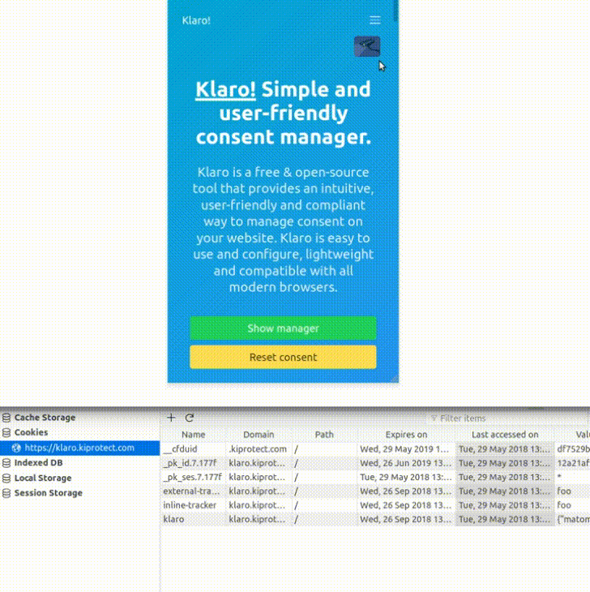

# Klaro! A Simple Consent Manager

Klaro [klɛro] is a simple consent manager that helps you to be transparent about the third-party applications on your website. It is designed to be extremely simple, intuitive and easy to use while allowing you to be compliant will all relevant regulations (notably GDPR and ePrivacy).

<p align="center"></p>

This GIF shows how Klaro deletes Cookies as the user disables apps. A full-length version of the video with subtitles and explanations is available on [Youtube](https://youtu.be/Bve7bh0gZig) as well as in [this repository](dist/assets/demo.mp4).

## Advantages

* **Free and Open Source**: No hidden fees, subscriptions or restrictions.
* **Easy to use**: Simply add a small JS snippet and config to your site and
  you're ready to go!
* **Flexible and customizable**: Manage consent for all possible types of
  third-party apps and easily customize the tool according to your needs.
* **Multilingual**: Full internationalization support, with languages included out of the box. New translations can be added in just a few lines of code. Contributions welcome! Current languages:
    - [x] Catalan
    - [x] Dutch
    - [x] English
    - [x] Finnish
    - [x] French
    - [x] German
    - [x] Greek
    - [x] Hungarian
    - [x] Italian
    - [x] Norwegian
    - [x] Romanian
    - [x] Spanish
    - [x] Swedish
    - [x] Turkish
* **Small footprint**: The minified+gzipped JS is only 18 kB and contains
  everything that is required, including style sheets and images.
* **Intuitive and responsive**: Klaro is designed to blend in with
  your existing design and optimized for modern desktop and mobile browsers.
* **Secure and reliable**: Klaro ensures that no third-party apps or
  trackers are executed without the consent of the user, even when
  JavaScript is disabled or Klaro itself gets blocked.

## Getting Started

To use the widget on your website, simply download [klaro.js](https://klaro.kiprotect.com/klaro.js) as well as the example config [config.js](https://klaro.kiprotect.com/config.js). Follow the instructions below to adapt the config to your needs and then include the two files in your website like this:
```html
<script defer type="text/javascript" src="config.js"></script>
<script defer type="text/javascript" src="klaro.js"></script>
```
Do not forget to change your existing apps/trackers as outlined in the next section as well so that Klaro can manage them. Klaro will automatically open on page load.

If you wish to open the consent manager manually on user interaction (for example through a link in the privacy policy), you can use the ```klaro.show()``` global. Example:
```html
<a class="button is-success" onclick="return klaro.show();">Change consent settings</a>
```

## Managing Third-Party Apps/Trackers

To manage third-party scripts and ensure they only run if the user consents with their use, you simply replace the `src` attribute with `data-src`, change the `type` attribute to `opt-in` and add a `data-type` attribute with the original type, and add a `data-name` field that matches the name of the app as given in your config file. Example:
```html
<script type="opt-in"
    data-type="text/javascript"
    data-name="optimizely"
    data-src="https://cdn.optimizely.com/js/10196010078.js">
</script>
```
Klaro will then take care of executing the scripts if consent was given (you can chose to execute them before getting explicit consent as well).

The same method also works for images, stylesheets and other elements with a `src` or `type` attribute.

### Configuration File

The consent manager is configured using a config dictionary, which you typically define in a separate JS file. To learn more, simply read the [annotated example config](dist/config.js), which contains descriptions of all valid config options and parameters.

## Building Klaro from Scratch

If you want to customize Klaro or extend it, you can build it from scratch using the following commands:
```sh
npm install
npm run-script make-dev #will run a development server
npm run-script make #will build the production version
```
## Contributing

Want to contribute? We'd love that!

If you have a feature request or bug to report, please fill out [a GitHub Issue](https://github.com/KIProtect/klaro/issues) to begin the conversation.

If you want to help out, but don't know where to begin, check out [the open issues tagged "help wanted"](https://github.com/KIProtect/klaro/labels/help%20wanted).

If you are multilingual, consider contributing a translation we don't have yet.

## License & Third-Party Libraries

This project is licensed under a BSD-3 license. A list of third-party libraries can be found in the [package.json](package.json) file.

The accompanying website uses [Bulma](https://bulma.io), [Bootstrap](https://getbootstrap.com) and [Prism](http://prismjs.com/) and a [surveillance camera image](https://upload.wikimedia.org/wikipedia/commons/5/56/Surveillance-camera.png) from Wikipedia.

## Troubleshooting

Do you have problems using Klaro? If so, we want to know it! Just open an issue here and if possible provide the following information to us:

* The website on which Klaro is installed (if possible)
* The config file you're using (a link is sufficient)
* The version of Klaro that you're using (you can get this by opening the developer tools of your browser, going to the "Console" tab and typing `klaro.version()` in the JS console.)
